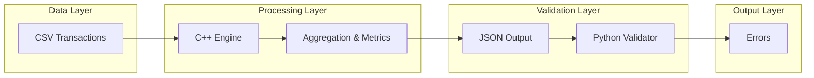

# Architecture

The system is designed as a multi-language data processing pipeline.

## Flow

CSV → C++ Engine → JSON → Python Validator → Final Output


## Components

### C++ Engine
- Responsible for high-performance data aggregation
- Processes CSV input
- Produces JSON report

### Python Validator
- Applies business rules
- Validates consistency of the generated report

## Design Rationale

Processing and validation are separated so to:
- improve modularity
- increase maintainability
- simulate a real enterprise architecture


## Sequence Diagram

```mermaid
sequenceDiagram
    participant User
    participant CppEngine as C++ Engine
    participant FS as File System
    participant PyValidator as Python Validator

    User->>CppEngine: Esegue l'engine con transactions.csv
    activate CppEngine
    CppEngine->>FS: Legge transactions.csv
    FS-->>CppEngine: Dati CSV
    CppEngine->>CppEngine: Processa le transazioni
    CppEngine->>FS: Genera report JSON (stdout > file)
    deactivate CppEngine

    User->>PyValidator: Esegue il validatore sul file JSON
    activate PyValidator
    PyValidator->>FS: Legge il report JSON
    FS-->>PyValidator: Dati JSON
    PyValidator->>PyValidator: Valida lo schema e le regole
    alt Validazione Superata
        PyValidator-->>User: Stampa "PASS" (Exit 0)
    else Validazione Fallita
        PyValidator-->>User: Stampa "FAIL" e gli errori (Exit 1)
    end
    deactivate PyValidator