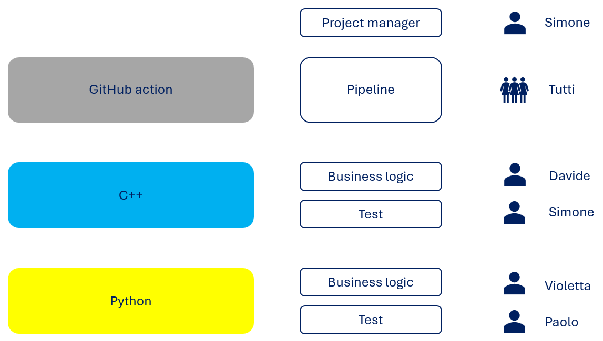
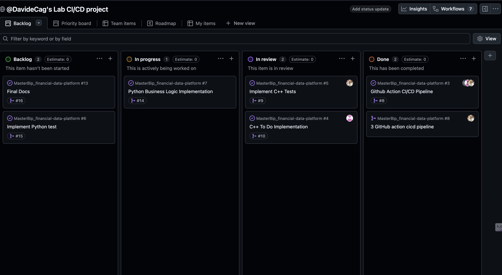

# Team Organization

The project was developed by a team of 4 simulating an enterprise structure.

## Roles

### Project Manager / Tech Lead (1 person)

- defined architecture and project structure
- coordinated development and reviews branches before merging

### DevOps Engineer (4 people divided in 2 sub-teams)

- designed and implemented 2 CI/CD pipelines, one for C++ and one for python
- managed automation and artifact sharing between the two

### C++ Developer (2 people)

- implemented the transaction processing engine
- handled performance and core logic
- implemented test cases with Google Test

### Python Developer (2 people)

- implemented validation logic
- designed and executed tests with pytest

## Collaboration

- GitHub used for version control and division of tasks in branches
- Pull Requests for code review
- Issues used for task tracking

